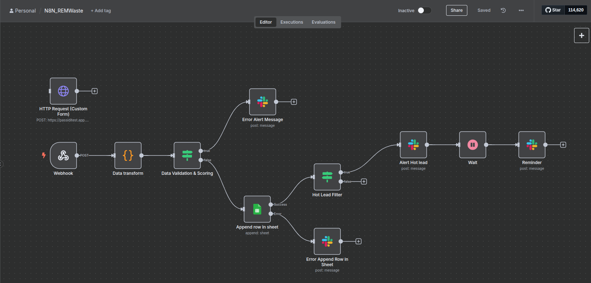

# n8n-workflows
A workflow built in n8n to process and score leads from a form, notify sales, and store in Google Sheets.

# 🔥 Lead Scoring & Notification Workflow – n8n

This n8n workflow automates the process of receiving, validating, scoring, and storing new leads, while notifying the sales team for high-quality opportunities.

---

## ✅ Features

- Accepts form submissions via webhook
- Validates required fields (name, email, budget, interest level)
- Scores leads (Hot / Warm / Cold)
- Stores data in Google Sheets
- Sends Slack alerts for Hot leads
- Sends follow-up message after 2 minutes (optional)

---

## 🧠 Scoring Logic

- **Hot**: Budget ≥ 5000 and Interest = High  
- **Warm**: Budget ≥ 3000 and Interest ≠ High  
- **Cold**: All others

---

## 🖼️ Screenshot

---

## 📦 Files

- `N8N_REMWaste.json`: Ready to import in your n8n instance
- `screenshot_1.png`: Visual of the flow

---

## 🛠️ How to Use

1. Import the JSON file into your n8n instance
2. Configure your Slack webhook & Google Sheet credentials
3. Trigger using a form (e.g. HTTP Requests) or test via Postman/webhook.site
